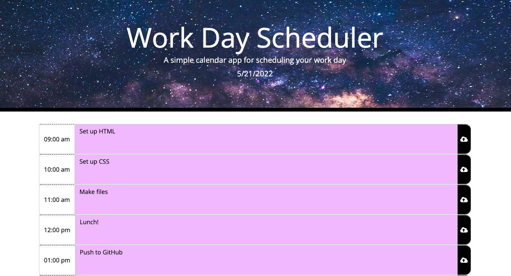

# Work Day Scheduler

This is a simple calendar application that allows the user to save events for each hour of the day. This app will run in the browser and feature dynamically updated HTML and CSS powered by jQuery.

## Technologies
Project is created with:
* HTML
* CSS
* JavaScript
* jQuery
* [Moment.js](https://momentjs.com/) library

## Launch
To launch this site, [click here](https://cammeer.github.io/Work-Day-Scheduler/)
